<h2 align="center">
    <a href="https://dainam.edu.vn/vi/khoa-cong-nghe-thong-tin">
    🎓 Faculty of Information Technology (DaiNam University)
    </a>
</h2>
<h2 align="center">
   XÂY DỰNG HỆ THỐNGCHẤM CÔNG VÀ TÍNH LƯƠNG TRÊN NỀN TẢNG ODOO
</h2>
<div align="center">
    <p align="center">
        
        
        
    </p>

[](https://www.facebook.com/DNUAIoTLab)
[](https://dainam.edu.vn/vi/khoa-cong-nghe-thong-tin)
[](https://dainam.edu.vn)

</div>

## 1. 📖 GIỚI THIỆU
Hệ thống Quản lý Nhân sự - Chấm công - Tính lương là giải pháp ERP tích hợp trên nền tảng Odoo 15, được thiết kế để tự động hóa quy trình quản lý nhân sự và tính lương cho doanh nghiệp vừa và nhỏ. Hệ thống tích hợp công nghệ nhận diện khuôn mặt (Face Recognition) cho việc chấm công tự động, áp dụng luật thuế thu nhập cá nhân 2026 với biểu thuế lũy tiến 5 bậc.

### ✨ Tính năng nổi bật:

**Module Nhân Sự:**
- Quản lý hồ sơ nhân viên đầy đủ (thông tin cá nhân, ngày sinh, địa chỉ, email, lương)
- Tự động mã hóa nhân viên theo định dạng yyyy-nnnn
- Lưu trữ ảnh khuôn mặt để phục vụ chấm công

**Module Chấm Công:**
- Chấm công tự động bằng nhận diện khuôn mặt (Face Recognition)
- Camera live view với FPS counter và guide overlay
- Tính toán tự động số phút đi muộn/về sớm
- Phân loại trạng thái: Đi làm, Đi muộn, Về sớm, Vắng mặt
- Báo cáo thống kê ngày công theo tháng

**Module Tính Lương:**
- Auto-sync lương từ hồ sơ nhân viên
- Tính toán tự động theo ngày công thực tế
- Áp dụng thuế TNCN lũy tiến 5 bậc (Luật 2026)
- Tính bảo hiểm: BHXH (8%), BHYT (1.5%), BHTN (1%)
- Giảm trừ gia cảnh: 15,500,000 VNĐ
- Cấu hình linh hoạt các tham số tính lương theo tháng
- Xuất phiếu lương PDF

## 2. 💻 CÔNG NGHỆ SỬ DỤNG
<p align="center">
  
  
  
  
  
  
</p>

**Backend:**
- Odoo Framework 15.0
- Python 3.10
- PostgreSQL 14

**AI & Computer Vision:**
- face_recognition (dlib)
- OpenCV (cv2)
- NumPy

**ORM & Database:**
- Odoo ORM
- PostgreSQL với jsonb support

## 3. 🚀 HƯỚNG DẪN CÀI ĐẶT
### 📋 Điều kiện tiên quyết
- Ubuntu 22.04 LTS (hoặc tương đương)
- Python 3.10+
- PostgreSQL 14+
- Git
- Webcam (cho tính năng chấm công)

### 🔧 Các bước cài đặt

1. **Clone repository:**
    ```bash
    git clone https://github.com/namhung1910/odoo-fitdnu.git
    cd odoo-fitdnu
    ```

2. **Cài đặt dependencies hệ thống:**
    ```bash
    sudo apt update
    sudo apt install -y python3-pip python3-dev libpq-dev \
        postgresql postgresql-contrib build-essential \
        libssl-dev libffi-dev libxml2-dev libxslt1-dev \
        zlib1g-dev libjpeg-dev libfreetype6-dev liblcms2-dev \
        libwebp-dev tcl8.6-dev tk8.6-dev python3-tk \
        cmake libboost-all-dev
    ```

3. **Cài đặt dlib (cho face_recognition):**
    ```bash
    # Cài dlib từ source
    git clone https://github.com/davisking/dlib.git
    cd dlib
    mkdir build; cd build; cmake ..; cmake --build .
    cd ..
    python3 setup.py install
    cd ..
    ```

4. **Tạo virtual environment và cài đặt Python packages:**
    ```bash
    python3 -m venv venv
    source venv/bin/activate
    pip install --upgrade pip
    pip install -r requirements.txt
    ```

5. **Cấu hình PostgreSQL:**
    ```bash
    sudo -u postgres createuser -s $USER
    createdb fitdnu-db
    ```

6. **Cấu hình Odoo:**
    - Copy file cấu hình mẫu:
    ```bash
    cp odoo.conf.example odoo.conf
    ```
    - Chỉnh sửa `odoo.conf` với thông tin database của bạn

7. **Khởi động Odoo:**
    ```bash
    source venv/bin/activate
    python3 odoo-bin.py -c odoo.conf -d fitdnu-db -i nhan_su,cham_cong,tinh_luong
    ```

8. **Truy cập hệ thống:**
    - Mở browser và truy cập: `http://localhost:8069`
    - Tài khoản mặc định: `admin` / `admin`

📌 Lưu ý:
- **Face Recognition:** Cần cài đặt dlib và face_recognition. Nếu gặp lỗi, tham khảo [hướng dẫn cài đặt dlib](https://github.com/davisking/dlib).
- **Camera Permission:** Đảm bảo ứng dụng có quyền truy cập webcam.
- **Port 8069:** Mặc định Odoo chạy trên port 8069, có thể thay đổi trong file `odoo.conf`.
- **Database:** Tên database mặc định là `fitdnu-db`, có thể thay đổi khi khởi động.

## 4. 📦 CẤU TRÚC DỰ ÁN

```
odoo-fitdnu/
├── addons/
│   ├── nhan_su/              # Module Quản lý Nhân sự
│   │   ├── models/
│   │   │   └── nhan_vien.py
│   │   ├── views/
│   │   │   └── nhan_vien_view.xml
│   │   ├── security/
│   │   └── __manifest__.py
│   │
│   ├── cham_cong/            # Module Chấm công
│   │   ├── models/
│   │   │   ├── bang_cham_cong.py
│   │   │   └── cham_cong_camera.py
│   │   ├── views/
│   │   │   ├── bang_cham_cong_view.xml
│   │   │   └── cham_cong_camera_view.xml
│   │   ├── security/
│   │   └── __manifest__.py
│   │
│   └── tinh_luong/           # Module Tính lương
│       ├── models/
│       │   ├── bang_luong.py
│       │   ├── chi_tiet_luong.py
│       │   └── cau_hinh_luong.py
│       ├── views/
│       │   ├── bang_luong_view.xml
│       │   ├── chi_tiet_luong_view.xml
│       │   └── cau_hinh_luong_view.xml
│       ├── data/
│       │   └── default_config.xml
│       ├── security/
│       └── __manifest__.py
│
├── odoo-bin.py               # Odoo executable
├── odoo.conf                 # Configuration file
├── requirements.txt          # Python dependencies
└── README.md
```

## 5. 📸 HÌNH ẢNH CHƯƠNG TRÌNH

### 👥 Module Nhân Sự
- Danh sách nhân viên:
    <p align="center">
    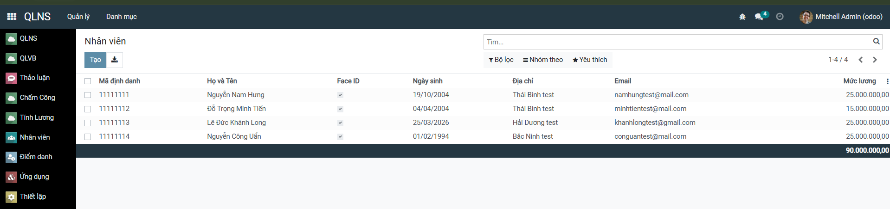
    </p>

- Form nhân viên chi tiết:
    <p align="center">
    
    </p>

### 📷 Module Chấm Công
- Camera chấm công (Face Recognition):
    <p align="center">
    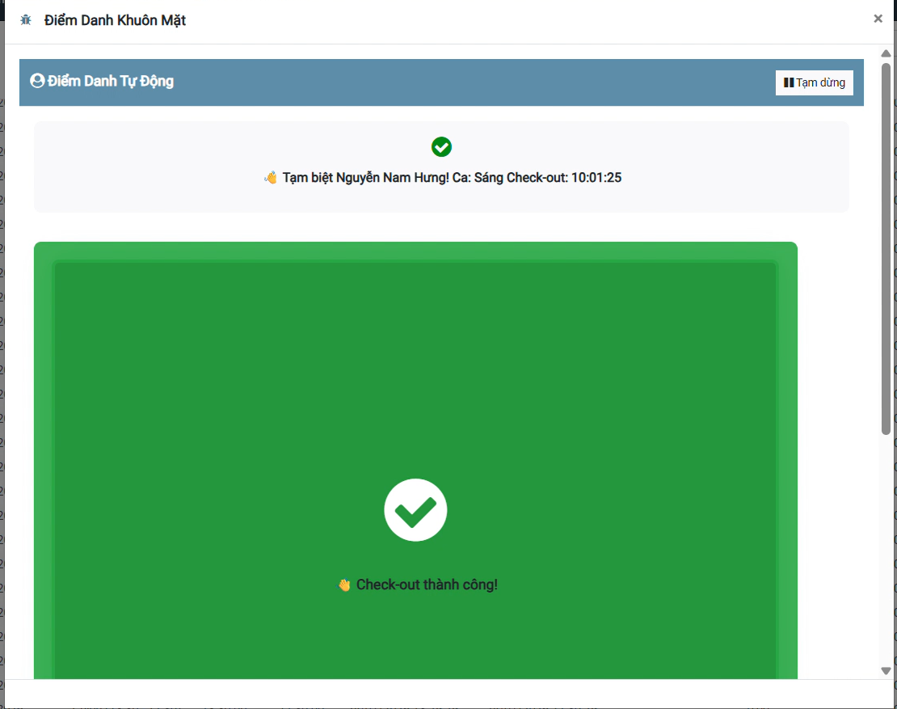
    </p>

- Bảng chấm công chi tiết:
    <p align="center">
    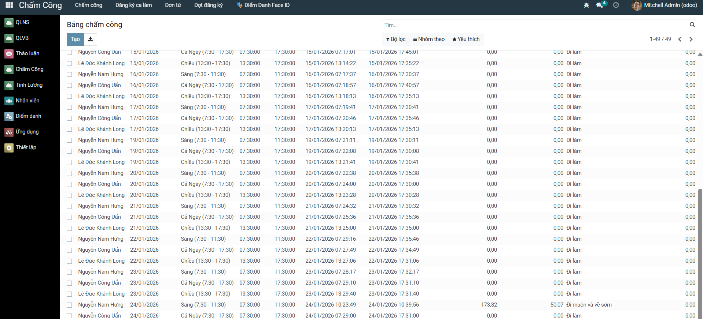
    </p>

### 💰 Module Tính Lương
- Bảng lương tháng:
    <p align="center">
    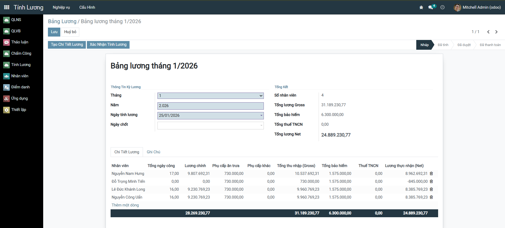
    </p>

- Giao diện chi tiết lương nhân viên

<p align="center">
  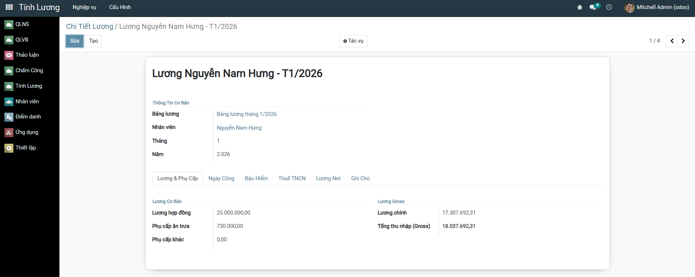
  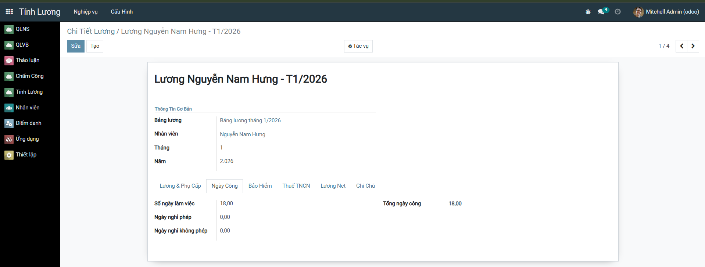
  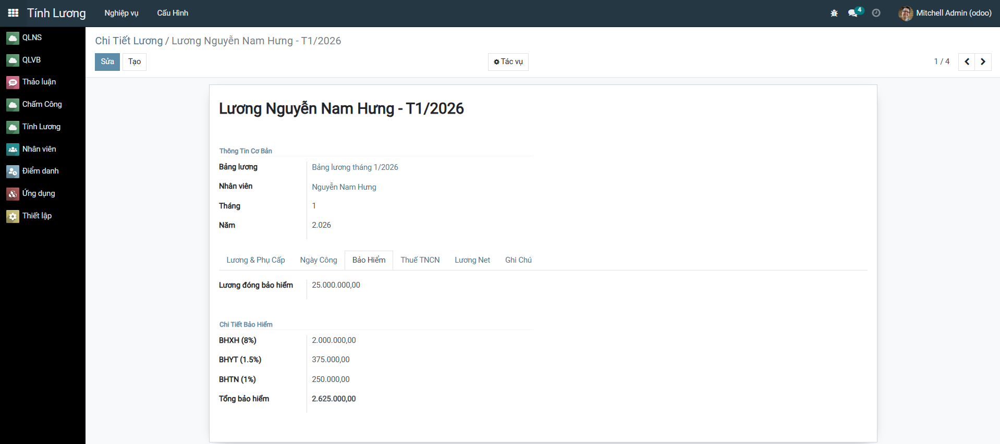
</p>
<p align="center">
  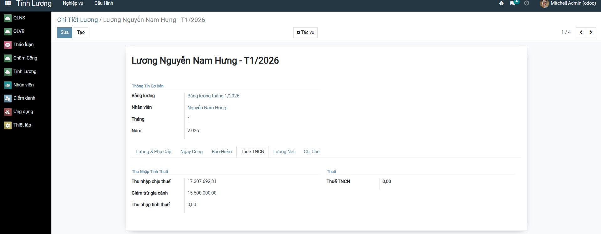
  
</p>

- Cấu hình lương cho các tháng:

<p align="center">
  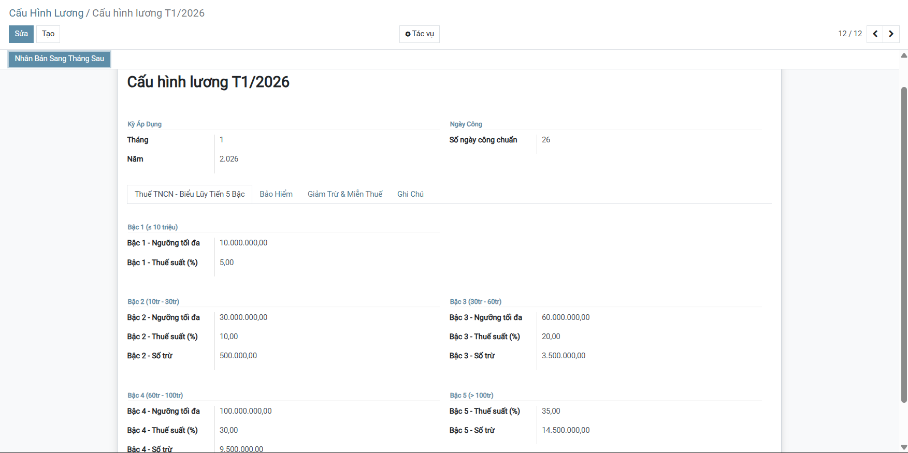
  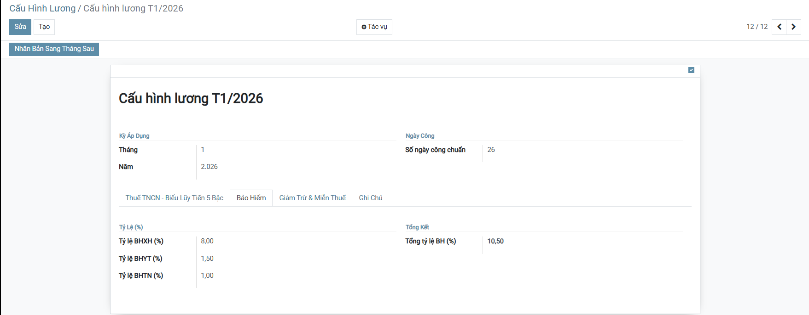
  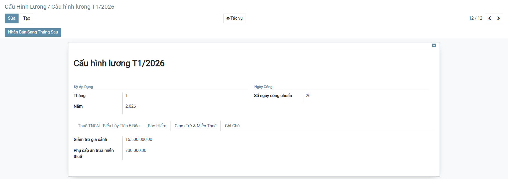
</p>

<p align="center">

## 6. 📊 CÔNG THỨC TÍNH LƯƠNG

### Lương Gross
```
Lương chính = (Lương hợp đồng ÷ 26) × Tổng ngày công
Tổng thu nhập = Lương chính + Phụ cấp ăn trưa + Phụ cấp khác
```

### Bảo Hiểm
```
BHXH = Lương đóng BH × 8%
BHYT = Lương đóng BH × 1.5%
BHTN = Lương đóng BH × 1%
Tổng BH = 10.5% × Lương đóng BH
```

### Thuế TNCN (Lũy tiến 5 bậc)
```
Thu nhập chịu thuế = Tổng thu nhập - 730,000 (phụ cấp miễn thuế)
Thu nhập tính thuế = Thu nhập chịu thuế - Tổng BH - 15,500,000 (giảm trừ)

Bậc 1 (≤10M):      Thuế = x × 5%
Bậc 2 (10-30M):    Thuế = x × 10% - 500,000
Bậc 3 (30-60M):    Thuế = x × 20% - 3,500,000
Bậc 4 (60-100M):   Thuế = x × 30% - 9,500,000
Bậc 5 (>100M):     Thuế = x × 35% - 14,500,000
```

### Lương Net
```
Lương thực nhận = Tổng thu nhập - Tổng BH - Thuế TNCN
```


## 9. 📚 TÀI LIỆU THAM KHẢO

- [Odoo Documentation](https://www.odoo.com/documentation/15.0/)
- [Face Recognition Library](https://github.com/ageitgey/face_recognition)
- [Luật Thuế TNCN 2026](https://thuvienphapluat.vn/chinh-sach-phap-luat-moi/vn/ho-tro-phap-luat/chinh-sach-moi/100277/bieu-thue-tncn-luy-tien-2026-bieu-thue-5-bac)

### 📞 Liên hệ: 
Nếu có thắc mắc hoặc góp ý, vui lòng liên hệ qua namhung1910@gmail.com

---
© 2026 Nhóm 13 CNTT 16-03. All rights reserved.
